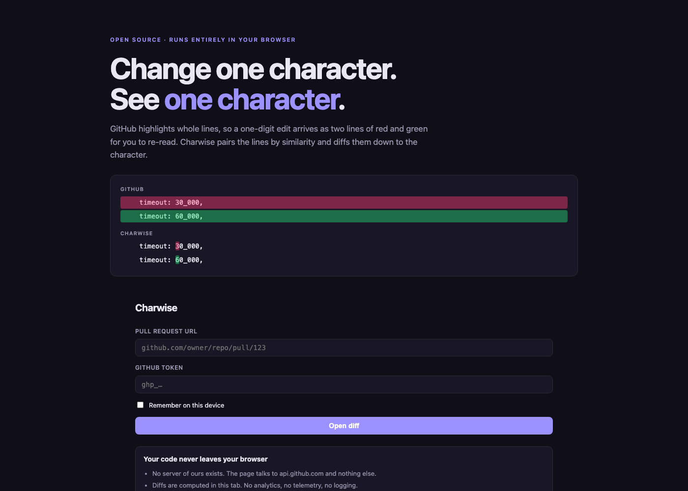
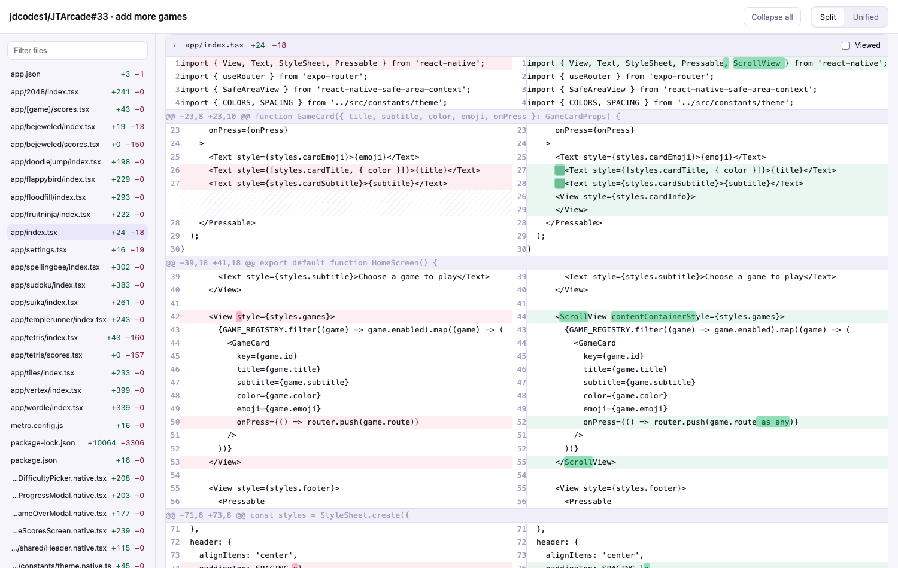
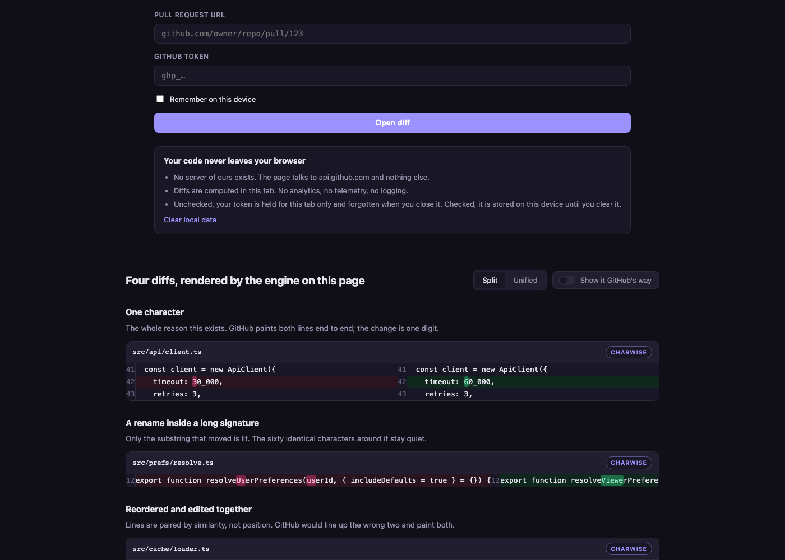

# Charwise

**Character-level diff viewer for GitHub pull requests.** Change one character,
see one character.

**[charwise.vercel.app](https://charwise.vercel.app)** · no signup, no server,
nothing to install



## The problem

GitHub highlights whole lines. Change a single digit and you get an entire red
line and an entire green line, and you have to find the difference by eye. It
also pairs deleted lines to inserted lines *by position*, so reordering code
produces two fully-highlighted lines that are actually identical.

Charwise pairs lines by **similarity**, then diffs each pair down to the
character:



`<View style=` became `<ScrollView contentContainerStyle=` — only the characters
that changed are lit. Whitespace-only changes are tinted rather than replaced,
so copying a line still gives you the original code. `@@` dividers separate
hunks, and unmatched lines sit opposite a hatched cell instead of being forced
into a false pair.

The landing page runs the real engine on four example patches, with a toggle to
flip them back to GitHub's whole-line rendering:



## Run it locally

```bash
npm install
npm run dev
```

Open http://localhost:5173, paste a PR URL, and paste a GitHub token with `repo`
scope (or `public_repo` for public repositories).

## Privacy

Everything runs in your browser.

- There is no server. The page contacts `api.github.com` and nothing else — no
  analytics, no telemetry, no CDN, no remote fonts.
- Your diffs are parsed and rendered in the tab. They are never uploaded anywhere.
- Your token is kept for the current tab only and forgotten when you close it,
  unless you tick **Remember on this device**. It is sent to `api.github.com` in
  an `Authorization` header, never in a URL.
- **Clear local data** on the start screen erases the token, the recent-PR list,
  and every viewed mark.

`npm test` enforces this: `src/privacy.test.ts` fails on any non-GitHub URL in the
source, and the Playwright suite fails if the running app makes one.

## Keys

| Key | Action |
|---|---|
| `j` / `]` | next file |
| `k` / `[` | previous file |
| `v` | mark the active file viewed |
| `u` | toggle split / unified |
| `/` | filter files |

## Tests

```bash
npm test     # unit
npm run e2e  # playwright smoke
```

## How it works

GitHub's API already gives you a line-level unified patch, so Charwise never
diffs a whole file. It re-diffs *inside* the patch, in four stages:

1. **Parse** the unified patch into hunks and typed lines.
2. **Pair** deletions to insertions by normalized LCS similarity above 0.6 —
   not by position. This is what makes reordered code readable.
3. **Refine** each pair: an LCS diff over tokens, then a second LCS pass over
   characters inside any changed run similar enough to be worth it. Unchanged
   runs shorter than three characters are absorbed so an edit reads as one span.
4. **Render** with layered emphasis — a faint tint on the changed line, full
   saturation only on the changed characters.

Every dimension is bounded, because LCS is O(n·m) in time and memory: lines over
2000 characters degrade to whole-line highlighting, and blocks over 10,000
comparisons pair within a window. See `context.md` for the full architecture and
the reasoning behind each constant.

## Contributing

`src/diff/` is pure TypeScript with no React, no DOM, and no dependencies — a
test enforces that. It is the interesting part, and it can be exercised without
rendering anything.

```bash
npm test     # unit tests
npm run e2e  # Playwright, including a privacy check
```

MIT licensed.
